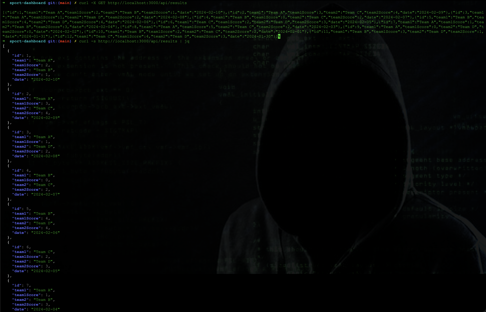
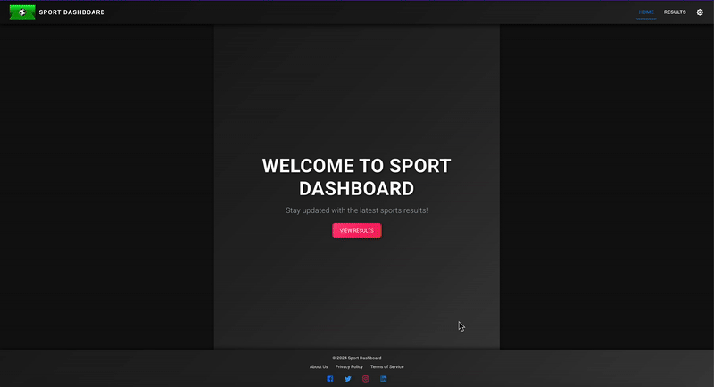
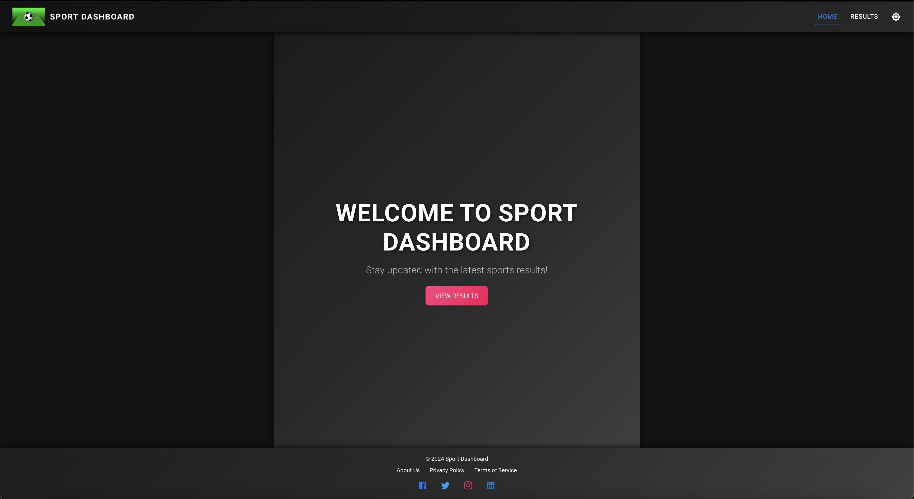
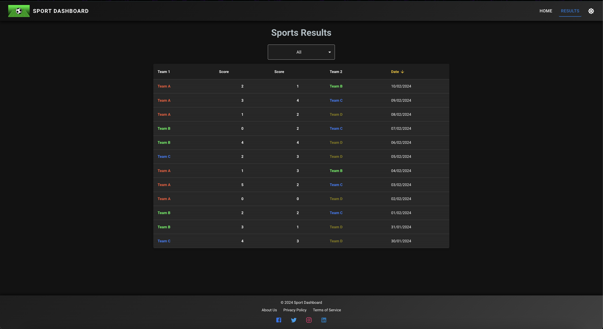
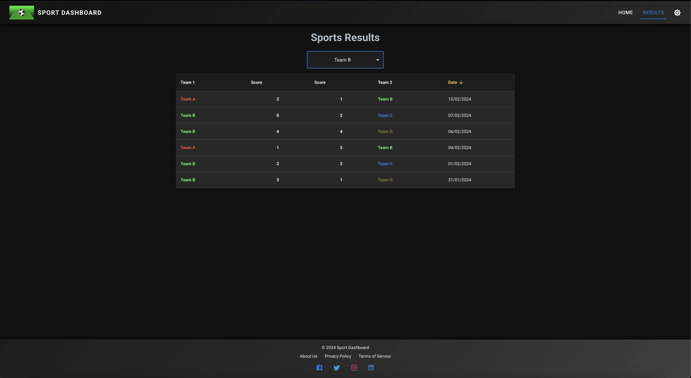
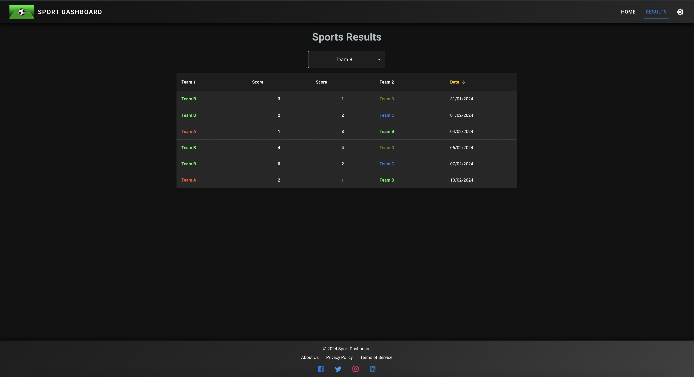

# Sport Dashboard
Sport Dashboard is a web application that provides sports match results with filtering, sorting, and dark/light mode support.  
It is built using modern web technologies and offers an interactive, user-friendly experience.

## Live Deployment 🌍🚀

The app has been deployed and is running in the cloud,
You can access it here:  

👉 **[Sport Dashboard Live](https://sport-dashboard-nw53.vercel.app/)**  

### Build on
Build on MacOS Sequoia 15.0.1

## Files structure
```sport-dashboard/
│── src/
│   ├── components/        # Reusable UI components (Navbar, Footer, ResultsTable, etc.)
│   ├── pages/             # Main pages (Home, Results, API routes)
│   │   ├── _app.tsx       # Global app wrapper
│   │   ├── _document.tsx  # Custom document structure
│   │   ├── index.tsx      # Homepage
│   │   ├── results.tsx    # Results page with server-side rendering
│   │   ├── api/           # API endpoints (Mock data)
│   ├── constants/         # Configuration files (API endpoints, team colors)
│   ├── types/             # Type definitions
│   ├── styles/            # Global styles (CSS)
│── public/                # Static assets (images, GIFs, etc.)
│── tsconfig.json          # TypeScript configuration
│── package.json           # Dependencies and scripts
│── .gitignore             # Files to be ignored in Git
│── README.md              # Documentation
```

## Frontend Architecture
The frontend is built with Next.js (TypeScript) and Material UI for styling. It provides a dynamic, interactive UI with the following structure:

- Pages (/pages) – Implements individual views (e.g., Home, Results).
- Components (/components) – Reusable UI elements like Navbar, Footer, ResultsTable.
- Constants (/constants) – Stores reusable values (e.g., team colors, API URLs).
- API (/pages/api) – Next.js API routes for fetching match results.
etc..

## Step-by-Step Setup

1. Clone the Repository
First open a new terminal window and clone the repository:
```bash
git clone https://github.com/jaroslavdusek1/sport-dashboard.git
cd sport-dashboard
```

2. Install Dependencies
```bash
npm install
```
or
```bash
yarn install
```

3. Start the development server
```bash
npm run dev
```
or
```bash
yarn dev
```

The application will start and be accessible at:
Frontend: [http://localhost:3000](http://localhost:3000)  

### Verify a running application via netstat:
```bash
Linux/Mac
netstat -tuln | grep 3000

On Mac (Alternative with lsof):
lsof -i :3000
```
## Fetching Data via Terminal (cURL)
You can retrieve match data directly from the API using cURL in the terminal.

1️⃣ Basic cURL request
This command fetches match results from the API in raw JSON format:
```bash
curl -X GET http://localhost:3000/api/results
```
2️⃣ Formatted JSON output using jq
```bash
curl -s http://localhost:3000/api/results | jq
```

You ll get this..


## App Imgs
#### Dark/Light toggle button (go for dark, light is ugly :})
<p align="center">
  
</p>

#### Dashboard


#### Results


#### Filtering


#### Sorting



Enjoy :]
